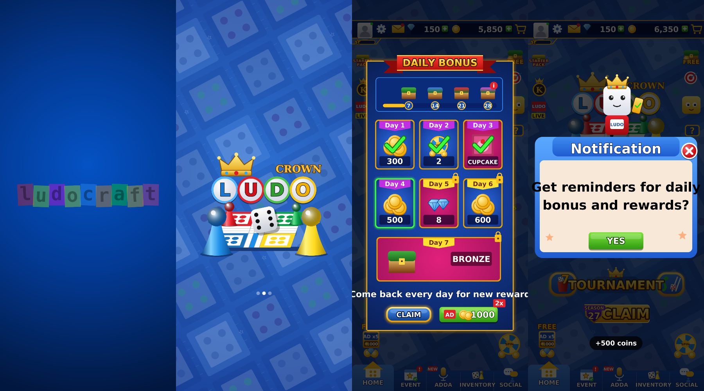
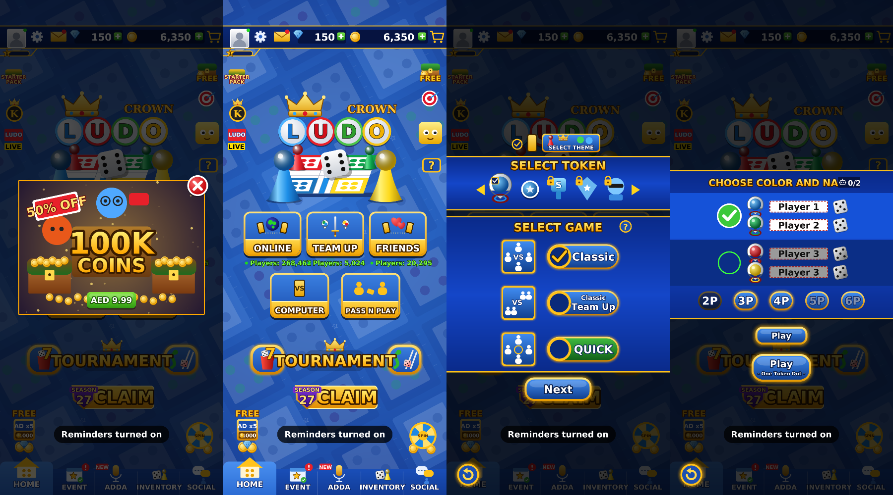
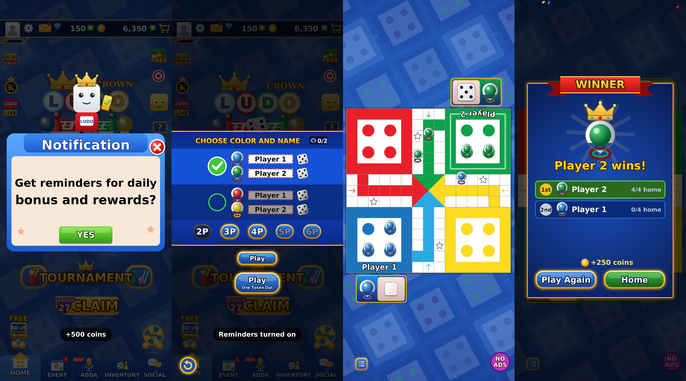
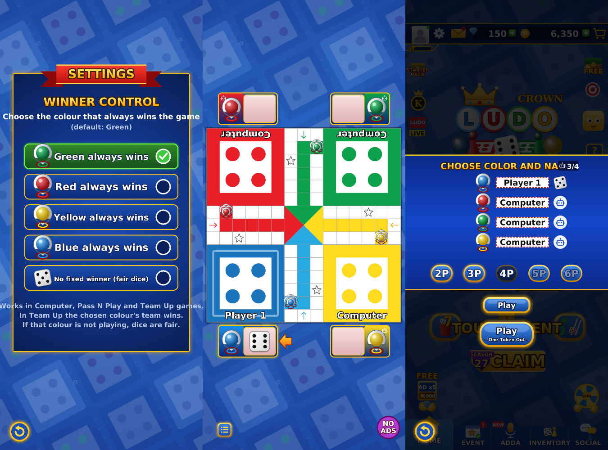

# Ludo Crown

An offline Ludo game for Android. The screens follow the usual Ludo app flow: studio splash, logo splash, home menu, daily bonus, reminder prompt, offer popup, Select Token/Game, Choose Color & Name, One Token Out, board, and winner screen.

**Download:** [`apk/LudoCrown.apk`](apk/LudoCrown.apk). Works on Android 5.0 and newer. To install it, allow "Install unknown apps" for your browser or file manager.

## Winner control
Tap the **gear** icon on the home screen (next to the avatar) to open **Settings → Winner Control**. From there you pick which colour always wins:

- **Green always wins** (default)
- Red, Yellow or Blue always wins
- No fixed winner (fair dice)

**PIN lock:** tap **Set PIN** on the same screen and choose a 4–8 digit PIN. Winner Control stays visible to everyone, but changing the colour (or the PIN) then needs that PIN. The PIN is stored as a hash. If you forget it, clear the app's data in Android settings to reset it.

Winner control works like this:
- Games look like normal, fair games. Every player gets a normal share of sixes and brings tokens out. The lead changes hands several times, and captures go both ways.
- The dice are only nudged, and the nudge grows as the game goes on. A player who pulls too far ahead gets slightly weaker rolls, and the chosen colour gets slightly better rolls when it falls behind.
- No other player is ever given the exact roll that would win the game, so the chosen colour always finishes first. Finishes are usually close.
- How strong the nudge is, how far others may lead, and when captures of the chosen colour become rare are all randomised for each game, so no two games play out the same way.
- In Team Up, the chosen colour's team wins.
- If the chosen colour is not in the game, the dice are fair.
- For every player, in every mode: the longer someone has had no token out, the likelier a six becomes, so nobody sits in the yard for long.

## Game modes
- **Computer / Online / Friends**: you play against computer players. This version has no online play.
- **Pass N Play**: all players take turns on one phone. Tap the dice icon next to a name to make that player a computer, and tap a name to change it.
- **Classic**: get all 4 tokens home to win.
- **Team Up**: 4 players, and opposite colours play as partners.
- **Quick**: all tokens start on the board, and the first token home wins.
- **Play – One Token Out**: every player starts with one token already on the board.

Rules:
- Rolling a 6 brings a token out.
- You get another turn after a 6, a capture, or bringing a token home.
- Three sixes in a row lose the turn.
- Tokens on star and start squares are safe.

## Sound
The game has sound effects for the dice, token steps, captures, tokens reaching home, sixes and wins, plus a vibration on capture. They're generated by `app/tools/SfxGen.java`. The speaker button in Settings turns sound and vibration on or off.

## Building
The app is plain Java with every graphic drawn on a Canvas: there are no image assets and no Gradle. Fonts: Lilita One and Roboto Condensed (SIL Open Font License) and Luckiest Guy (Apache 2.0), in `app/assets/fonts` with their licences. It builds with the Debian/Ubuntu Android SDK packages:

```
sudo apt-get install android-sdk-build-tools android-sdk-platform-23 dalvik-exchange apksigner zipalign
./app/build.sh          # -> app/build/LudoCrown.apk
```

`app/debug.keystore` (password `android`) signs every build with the same key, so new versions install over old ones.

## Screens




